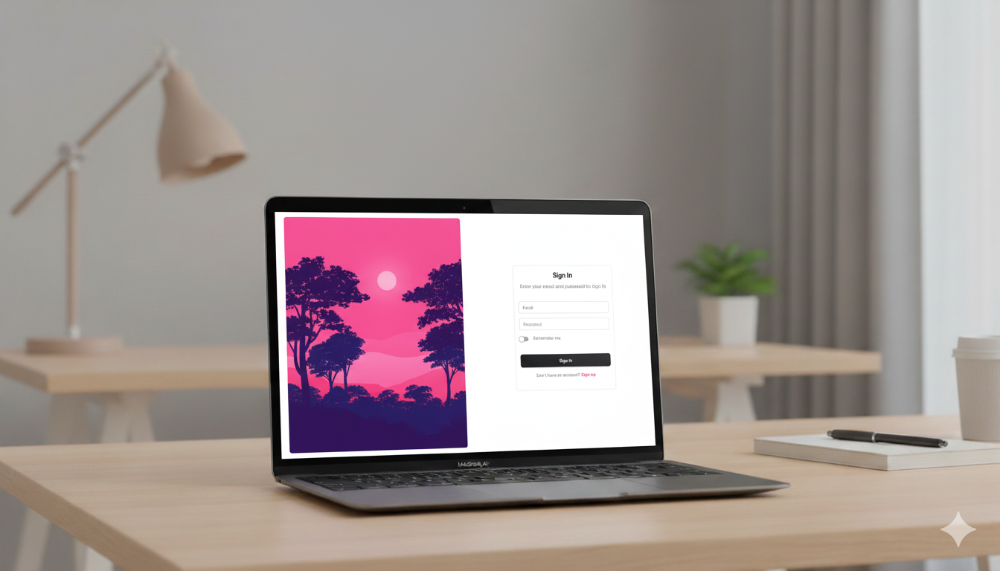
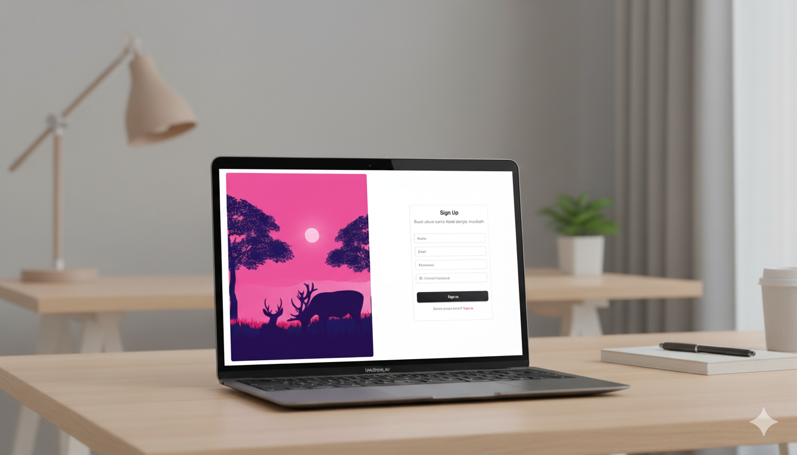
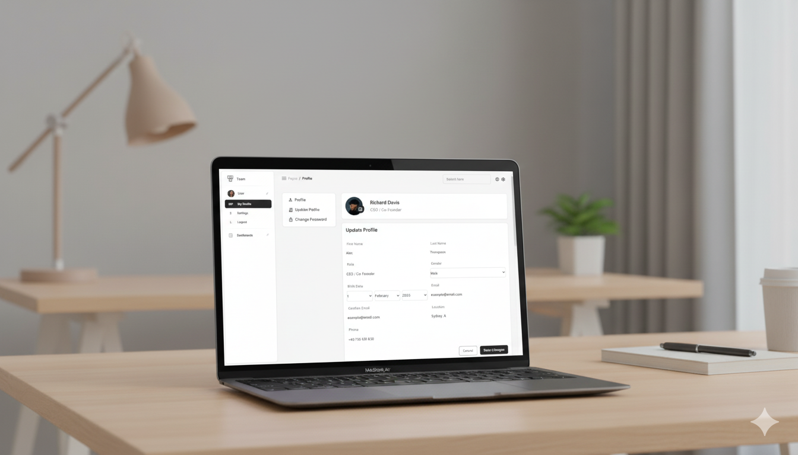

# 🚀 Web Application (CodeIgniter 3 + HMVC)

Proyek ini adalah aplikasi berbasis **PHP (CodeIgniter 3 dengan HMVC Modules)** yang berjalan menggunakan **Laragon v6.0** sebagai local server, serta menggunakan **MySQL** sebagai database.  
UI untuk dashboard menggunakan **Material Dashboard 3**.

---

## 📌 Tech Stack
- **Backend** : PHP (CodeIgniter 3 + HMVC)
- **Database** : MySQL
- **Local Environment** : Laragon v6.0
- **UI** : Material Dashboard 3

## ⚙️ Installation

1. Pastikan **Laragon v6.0** sudah terpasang di perangkat Anda.
2. Clone atau download repository ini.
3. Letakkan folder project ke dalam direktori C:/laragon/www/
4. Buat database baru di **phpMyAdmin** atau tool database Laragon.
5. Import file database yang tersedia (`.sql`).
6. Sesuaikan konfigurasi database pada file `application/config/database.php`
7. Akses project melalui browser: http://localhost/chat

---

## 🌐 Pages
- **Login Page**
- **Register Page**
- **Dashboard (Profile Module)**  
- Menggunakan **Material Dashboard 3** sebagai template.

---

## ✨ Features
- Sistem login dengan session otomatis **expired setelah 2 jam**.
- Struktur modular (HMVC) memudahkan pengembangan fitur baru.
- Tampilan dashboard modern dengan **Material Dashboard 3**.

---

## 🔑 Test Account
Gunakan akun berikut untuk mencoba login:

- **Email** : `admin@test.com`  
- **Password** : `qwertyuiop`

---

## 🖼️ Preview
Kumpulan gambar website (tambahkan sesuai kebutuhan):

- 
- 
- 

